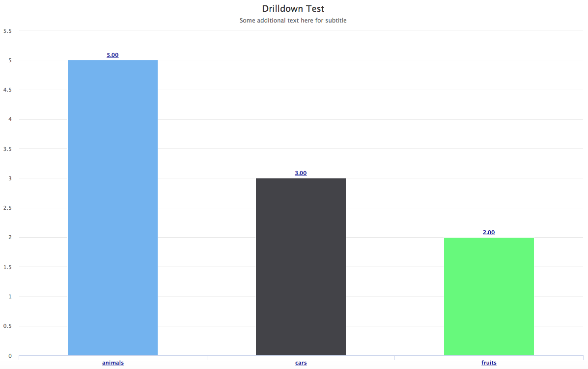
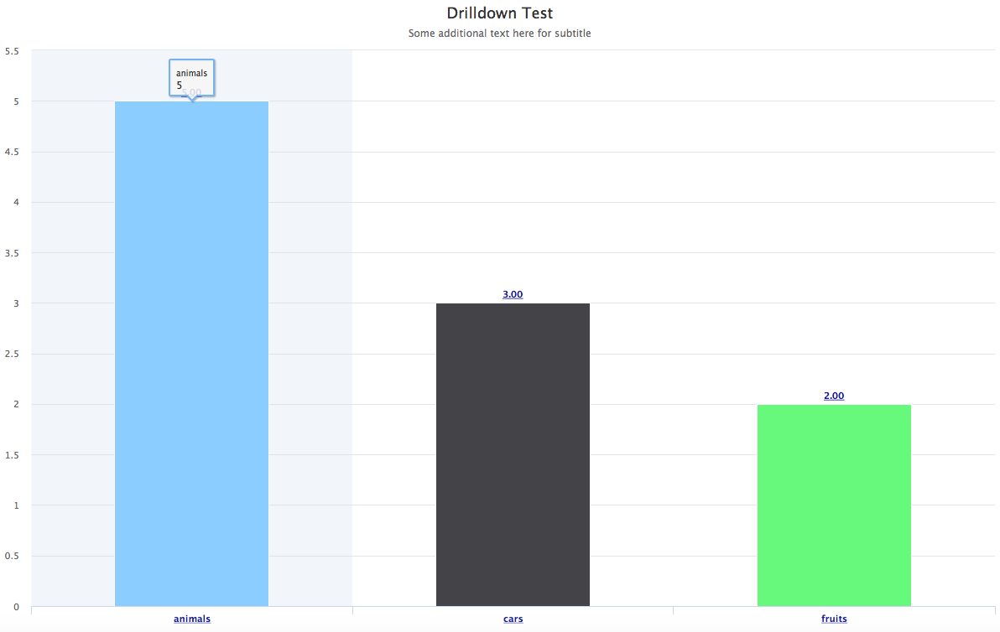
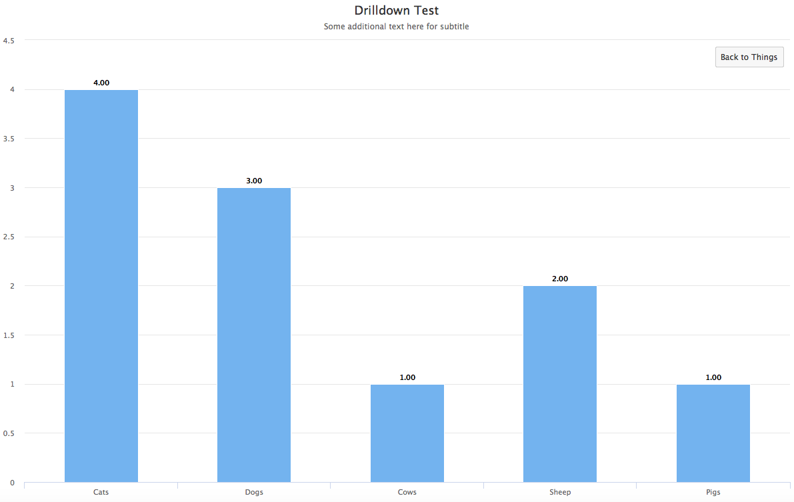
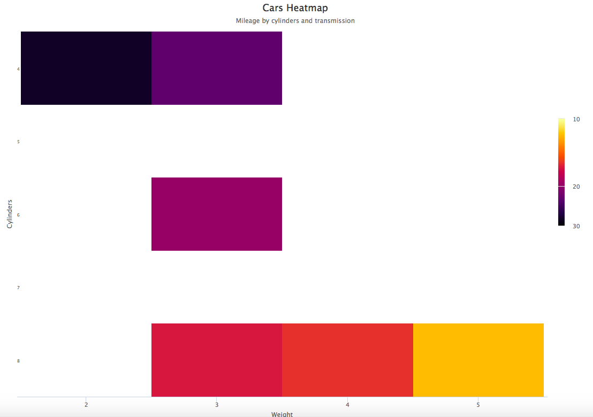
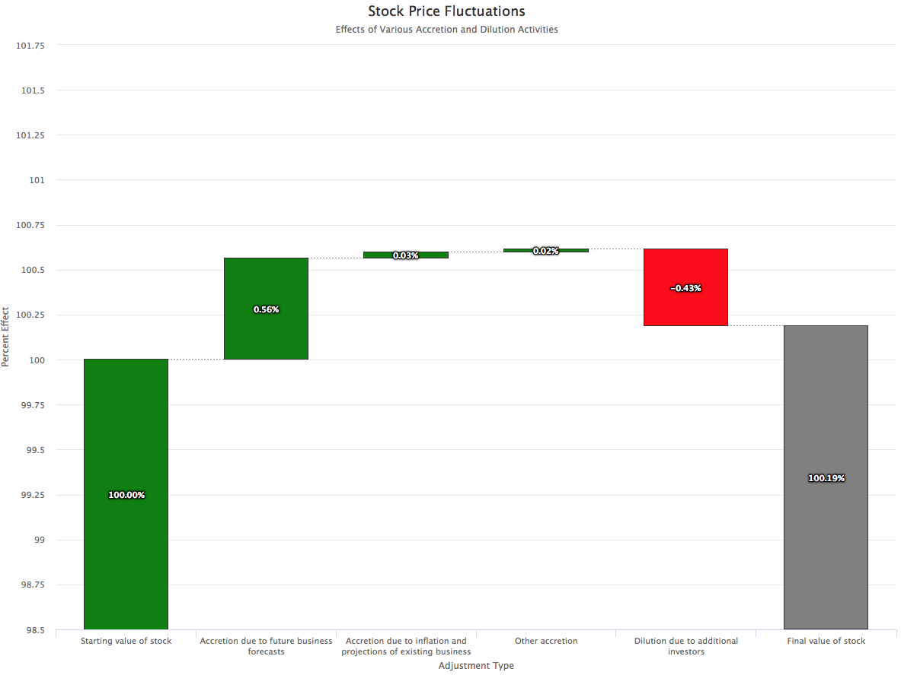
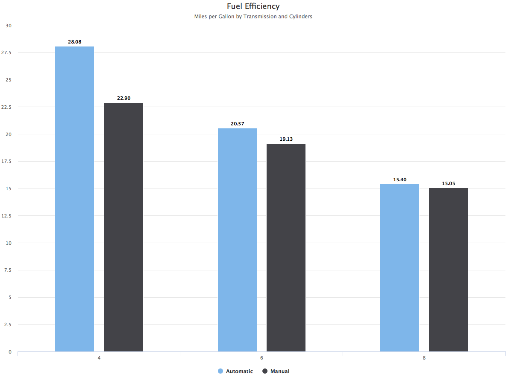

```{r setup, include=FALSE}
knitr::opts_chunk$set(echo = TRUE)
library(shinyBoots)
library(purrr)
```

## R Markdown

The shinyBoots package contains functions that fall into the following general categories:

* Functions to create boostrap elements

* Functions to create a reactive app with CRUD functions (create, retrieve, update, and delete)

* Functions to create charts and visualizations

* Functions to handle CSV files in a Shiny app

* Functions to manipulate data.

## Highcharter and Data Manipulation Functions

As an example of what's possible with single line functions, see the following examples that use a common dataset.

### Sample Drilldown Chart

```{r sampleDataset}
df <- data.frame(
 name = c("Toyota", "Ford", "Volkswagen", "Cats", "Dogs", "Cows", "Sheep", "Pigs", "Apple", "Oranges"),
 value = c(4, 2, 2, 4, 3, 1, 2, 1, 4, 2),
 id = c(rep("cars",3), rep("animals",5), rep("fruits",2)),
 stringsAsFactors = FALSE
 )
```

### Drilldown Chart

```{r drilldownChart, eval=FALSE}
createDrilldown(df,"id","Drilldown Test","Some additional text here for subtitle")
```

The following images show how a drilldown chart works within an HTML page (the images below are static, but in an html page, they would be dynamic and interactive).

 





### Heatmap Chart

```{r heatmapChart, eval=FALSE}
library(dplyr)
dfCars <- mtcars %>% group_by(cyl,wt = round(wt,0)) %>% summarise(mpg = mean(mpg))
createHeatmap(dfCars,"wt","cyl","mpg","Cars Heatmap","Mileage by cylinders and transmission","Weight","Cylinders")
```

This is an example of the output of a heatmap chart:



### Waterfall Chart

```{r waterfallChart, eval = FALSE}
dfNames <- c("Starting value of stock",
"Accretion due to future business forecasts",
"Accretion due to inflation and projections of existing business",
"Other accretion",
"Dilution due to additional investors","Final value of stock")
dfValues <- c(416468,2338,140,72,-1773,NA)
isIntermediateSum = c(0,0,0,0,0,0)
isSum = c(0,0,0,0,0,1)
createWaterfall(dfNames, dfValues, isSum, isIntermediateSum,"Stock Price Fluctuations",
"Effects of Various Accretion and Dilution Activities","Adjustment Type","Percent Effect")
```

Example of a waterfall chart:



### Simple Column Chart with Series Transformation

Here is an example of a simple column chart as well as a series transformation function using the well-known mtcars dataset.

```{r columnChart, eval = FALSE}
library(dplyr)
dat2 <- prepSeries(mtcars,"cyl","am","mpg") %>% mutate(am = ifelse(am == 1,"Automatic","Manual"))
datSeries <- changeToSeries(dat2,"am")
createColumn(datSeries,unique(dat2$cyl),"Fuel Efficiency","Miles per Gallon by Transmission and Cylinders")
```


